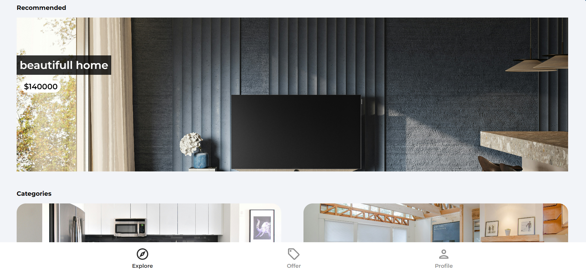

# Property Purchasing Website

## Description

This is a comprehensive property purchasing website where users can browse, sale or rent houses. It provides a seamless experience for both buyers and sellers to connect and transact.

## Features

-   View detailed information about each property including images, description, amenities, and contact details.
-   List properties for sale or rent with customizable options and preferences.
-   User authentication and authorization system for secure access and management of listings, implemented with Firebase Authentication.
-   Authentication methods include email/password, Google sign-in, and password reset functionality.
-   Messaging system to facilitate communication between buyers and sellers.
-   Interactive map integration for visualizing property locations and nearby amenities.
-   Responsive design for optimal viewing across devices.

## Technologies

-   React
-   TypeScript
-   Firebase (Firestore, Authentication, Storage)
-   Leaflet (React-Leaflet)
-   Swiper
-   React Toastify

## Setup

1. Clone this repository to your local machine.
2. Run `npm install` to install the necessary dependencies.
3. Ensure you have your own geocode API key from Google Cloud Platform.
4. Create a `.env` file in the root directory of the project.
5. Add the following environment variables to your `.env` file:
    - `VITE_GEOCODE_API_KEY = "<your geocode api key here>"`
6. Save the `.env` file.
7. Run `npm run dev` to start the development server.

## Demo

You can view the live demo [here](https://property-purchase-app.vercel.app/)
